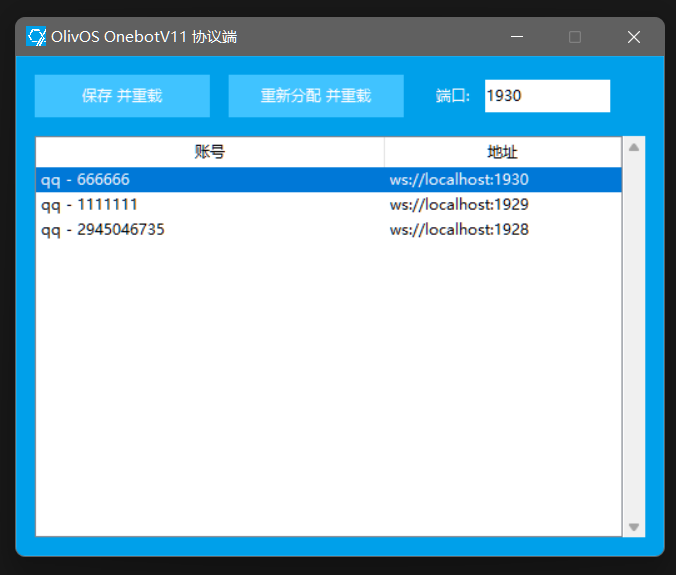

# OlivOSOnebotV11
Onebot V11 for OlivOS

基于[OlivOS](https://github.com/OlivOS-Team/OlivOS)的[OneBot](https://onebot.dev/)协议端，可以基于OlivOS实现**多后端**对**多账号**、**多平台**的支持。

### 鸣谢
本项目基于以下项目进行开发
- [OlivOS-Team/OlivOS](https://github.com/OlivOS-Team/OlivOS)
- [dpallot/simple-websocket-server](https://github.com/dpallot/simple-websocket-server)
- [OneBot](https://onebot.dev/)

### 开始使用
在不进行任何设置的前提下即可使用本插件，你可以通过插件菜单打开设置面板查看并修改端口，未设置时将在第一次启动时为每个账号生成一个可用端口。  



### 进阶使用
在`OlivOS`的`0.9.7`版本后的启动流程中你将能直接在日志中看到如下内容，其表明了每个已被加载的账号被分配到的的`hash`

```powershell
[2022-03-23 23:06:50] - [INFO] - init account from [./conf/account.json] ... done
[2022-03-23 23:06:50] - [INFO] - generate [qq] account [123456789] as [3cfede0d58a99a0fe71846310e9cac47] ... done
[2022-03-23 23:06:50] - [INFO] - generate [telegram] account [456789123] as [48781dc6c1de335c504572b51420ea52] ... done
[2022-03-23 23:06:50] - [INFO] - generate [kaiheila] account [987654321] as [dea0b0e07ef3728456d4520eedc62fe7] ... done
[2022-03-23 23:06:50] - [INFO] - generate account ... all done
```

你需要创建或编辑`plugin/data/OlivOSOnebotV11/config.json`文件，其结构示例如下

```json
{
    "route": [
        {
            "hash": "3cfede0d58a99a0fe71846310e9cac47",
            "port": 44007
        },
        {
            "hash": "48781dc6c1de335c504572b51420ea52",
            "port": 44008
        },
        {
            "hash": "dea0b0e07ef3728456d4520eedc62fe7",
            "port": 44009
        }
    ]
}
```

这表明了每个账号将会分别对应的端口，如果设置成功，你将会看到如下日志内容

```powershell
[2022-03-23 23:06:54] - [INFO] - [OlivOSOnebotV11] - 账号 [qq|123456789] 运行于Websocket，请使用 [ws://127.0.0.1:44007] 进行连接
[2022-03-23 23:06:54] - [INFO] - [OlivOSOnebotV11] - 账号 [telegram|456789123] 运行于Websocket，请使用 [ws://127.0.0.1:44008] 进行连接
[2022-03-23 23:06:54] - [INFO] - [OlivOSOnebotV11] - 账号 [kaiheila|987654321] 运行于Websocket，请使用 [ws://127.0.0.1:44009] 进行连接
```

并且，当你的后端完成连接时，你将看到如下日志内容，这意味着你的整个配置过程已经彻底完成，并将开始正常运作

```powershell
[2022-03-23 23:07:12] - [INFO] - [OlivOSOnebotV11] - ('::ffff:X.X.X.X', YYYYY, 0, 0) - connected to [44008] for [telegram|456789123]
```

### 需要注意

本插件虽然可以基于[OlivOS](https://github.com/OlivOS-Team/OlivOS)实现后端服务的跨平台，但是仍然需要后端服务本身给予足够的业务逻辑支持。
